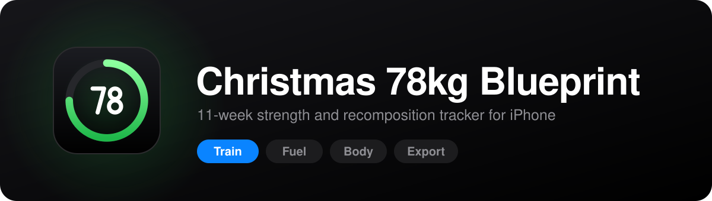
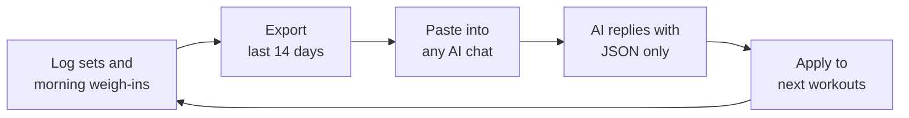

<div align="center">



<br>


**Log every set. Weigh in every morning. Let an AI set your next session.**

[Features](#features) &nbsp;/&nbsp; [The loop](#the-loop) &nbsp;/&nbsp; [Quick start](#quick-start) &nbsp;/&nbsp; [Data formats](#data-formats) &nbsp;/&nbsp; [Conventions](#project-conventions)

</div>

<br>

## Overview

Blueprint is a self-contained training app for an 11-week strength and body recomposition plan. It runs from one `index.html`, looks and behaves like a native iOS app, and keeps all of its data in the browser on your phone.

It does three jobs:

1. **Shows the plan** for each phase and day: exercises, sets, rep ranges, tempo, rest, load targets, meals and the peri-workout stack.
2. **Records what you actually did**: weight, reps and sets for every exercise, plus a morning weigh-in with body fat.
3. **Closes the loop with an AI**: it exports the last two weeks in a compact format, and imports the AI's reply to update your next workouts and nutrition target.

<br>

## Features

<table>
<tr>
<td width="50%" valign="top">

### Train
- Phase switcher and a week-by-week day selector
- Per-set **kg** and **reps** inputs with a done check
- Ghost values from your last session of the same lift
- One tap on the check logs a set using those ghost values
- Add extra sets when a session calls for it
- Green **Next** line when an AI prescription is active

</td>
<td width="50%" valign="top">

### Fuel
- Calories, protein and carbs for the phase
- Fats, water, creatine and the other phase targets
- Five-meal schedule with macros per meal
- Peri-workout stack timings
- **AI-adjusted target** row when you have applied one

</td>
</tr>
<tr>
<td width="50%" valign="top">

### Body
- Date, weight and body fat in three fields, saved as you type
- Live lean mass and fat mass
- 7-day average and change versus the week before
- Last 14 entries at a glance

</td>
<td width="50%" valign="top">

### Export
- Last 14 days of training and body data in a compact format
- Paste box that applies the AI's JSON reply
- List of active prescriptions with a one-tap clear
- Backup, restore and erase tools

</td>
</tr>
</table>

<br>

## The loop



1. Train and log your sets. Weigh in each morning at the same time.
2. Open **Export** and tap **Copy for AI analysis**.
3. Paste it into an AI chat. The prompt tells the AI to answer with one JSON object and nothing else.
4. Paste the reply into **Update workouts** and tap **Apply to next workouts**.
5. Your next sessions show updated kg, sets and reps, and the Fuel tab shows the adjusted nutrition target.

Your base plan is never rewritten. Prescriptions are stored as an overlay, and clearing them restores the original plan.

<br>

## Quick start

### 1. Host it

iOS only gives a proper offline home-screen app from a web address, not from a file opened in the Files app. Put `index.html` and `sw.js` in the same folder on any static host with HTTPS, for example GitHub Pages:

```bash
git add index.html sw.js assets/
git commit -m "Add Blueprint app"
git push
# Repo Settings > Pages > Deploy from branch
```

### 2. Add it to your iPhone

1. Open the hosted address in **Safari**.
2. Tap **Share**, then **Add to Home Screen**.
3. Launch it from the new icon. It opens full screen with no browser bars.

The icon is embedded in `index.html`, so it needs no extra files. iOS saves the icon at the moment you add the app, so after changing the logo, delete the old home-screen icon and add it again.

### 3. Run it locally

Open `index.html` in a desktop browser. No build step and no server are needed.

> [!IMPORTANT]
> A home-screen app has its own storage, separate from Safari. If you delete the icon and add it again, you start empty. Use **Export > Copy backup** first and **Restore from backup** afterwards.

<br>

## Data formats

<details>
<summary><b>What the export looks like</b> (sample values)</summary>

<br>

```text
WINDOW: 2026-10-12 to 2026-10-25, 8 sessions, 96 sets
BODY (morning weigh-ins) date|kg|bf%|lean kg|fat kg
2026-10-12|69.8|17.9|57.3|12.5
TREND 7d avg (change vs prior 7d): kg 70.21 (+0.43), bf% 17.80 (-0.10), lean 57.70 (+0.45), fat 12.50 (-0.02)
LOG
2026-10-12 MON P1 Push A (Chest, Shoulders, Triceps)
Incline DB Bench Press (30°)|3x8-10|tgt 20kg → 25kg|20:10,9,8|e1RM 26.7
```

Each exercise line is `name | sets x rep range | target | kg:reps per set | top-set Epley e1RM`. Sets at the same weight are grouped. Skipped exercises are marked `skipped`, and training days with no session are marked `MISSED`.

</details>

<details>
<summary><b>What the AI must reply with</b></summary>

<br>

```json
{
  "lift": [
    { "d": "MON", "e": "Incline DB Bench Press (30°)", "kg": 22.5, "s": 3, "r": "8-10" }
  ],
  "nutrition": { "kcal": 2360, "p": 175, "c": 280, "f": 60 }
}
```

| Field | Meaning | Accepted |
| :-- | :-- | :-- |
| `d` | Day code | `MON` to `SUN` |
| `e` | Exercise name | Matched to the plan, ignoring case and punctuation |
| `kg` | Load | Number, 0 or more |
| `s` | Sets | Integer from 1 to 8 |
| `r` | Rep range | `8-10` or a single number |
| `kcal`, `p`, `c`, `f` | Daily calories and grams of protein, carbs, fat | Within sane ranges, and `4p + 4c + 9f` within 3% of `kcal` |

The importer finds the JSON even when the AI wraps it in text or a code fence. Anything it cannot match or validate is listed as skipped, and the rest still applies.

</details>

<details>
<summary><b>How nutrition changes are decided</b></summary>

<br>

The prompt tells the AI to judge fat mass and lean mass trends, not scale weight alone. It compares the 7-day average with the week before, and it ignores body fat moves under 0.5 points because readings are noisy.

| Situation | Calories |
| :-- | :-- |
| Gain above expected, body fat flat or falling | Keep |
| Gain above expected, body fat up over 0.5 points or fat mass up over 0.3 kg/wk | Cut 100-150, carbs first |
| Weight stable, body fat falling | Keep (recomp) |
| Gain below expected, body fat flat or rising | Add 100-150, carbs first |
| Gain below expected, body fat falling and lean mass rising | Keep |
| Weight and body fat both flat | Add 100-150 in phases 1 and 2 |
| No body fat data | Weight only, change of 100 at most |

In phase 1 weeks 1-3 the prompt also warns that scale weight includes about 2-2.5 kg of creatine and glycogen water.

</details>

<details>
<summary><b>How data is stored</b></summary>

<br>

Everything lives in `localStorage` under the key `christmas_plan_state`:

```jsonc
{
  "v": 1,
  "logs": { "2026-10-12": { "p": 1, "d": "MON", "ex": [ { "n": "Incline DB Bench Press (30°)", "s": [ { "w": "20", "r": "10", "ok": true } ] } ] } },
  "rx":   { "MON|Incline DB Bench Press (30°)": { "kg": 22.5, "s": 3, "r": "8-10", "p": 1, "at": "2026-10-26" } },
  "nx":   { "kcal": 2360, "p": 175, "c": 280, "f": 60, "ph": 1, "at": "2026-10-26" },
  "body": { "2026-10-12": { "w": 69.8, "bf": 17.9 } }
}
```

`logs` are your sessions, `rx` the lift prescriptions, `nx` the nutrition target and `body` the weigh-ins. Prescriptions only apply in the phase they were made for.

</details>

<br>

## The 11-week plan

| Phase | Dates | Objective | Target weight | Calories |
| :-- | :-- | :-- | :-- | :-- |
| **1** | Oct 9 - Nov 5 | Sarcoplasmic refill and neural jump | 69.4 → 73.0 kg | 2,360 |
| **2** | Nov 6 - Dec 3 | Anabolic mass surge | 73.0 → 76.5 kg | 2,685 |
| **3** | Dec 4 - Dec 25 | Peaking, hardening and recomp | 76.5 → 78.0 kg | 2,455 |

The week runs Push (Mon), Pull (Tue), Recovery (Wed), Lower body (Thu), Upper body and arms (Fri), then rest on the weekend. The app opens on the phase and day for today's date.

<br>

## Project conventions

- **One file.** The whole app is `index.html`. `sw.js` is an optional offline cache, and the app works without it.
- **No external dependencies.** No CDN scripts, frameworks or web fonts, so it works fully offline.
- **Plan data is fixed.** The `phaseData` object holds the baseline numbers, phase dates, macros, tempos and targets. UI and feature changes must not alter it. AI adjustments are stored as overlays, never written into it.
- **Storage key.** State is saved under `christmas_plan_state`.
- **Touch targets.** `.phase-btn`, `.day-btn` and `.set-pill` stay at least 44 x 44 px.

<br>

## Repository layout

```text
.
├── index.html          # the entire app: UI, logic and plan data
├── sw.js               # optional service worker for offline launch
├── README.md
└── assets/
    ├── logo.svg               # master logo (1024 x 1024)
    ├── apple-touch-icon.png   # 180 x 180 home-screen icon
    ├── icon-192.png           # 192 x 192
    ├── icon-512.png           # 512 x 512
    ├── icon-1024.png          # 1024 x 1024
    ├── favicon-32.png         # browser tab icon
    └── banner.svg             # README banner
```

<br>

## Privacy

The app makes no network requests. Your logs, weigh-ins and prescriptions stay in the browser on your device. The only way data leaves is when you copy an export or backup yourself.

<br>

<div align="center">

<sub>A personal training tool. It is not medical advice and does not replace professional guidance.</sub>

</div>
